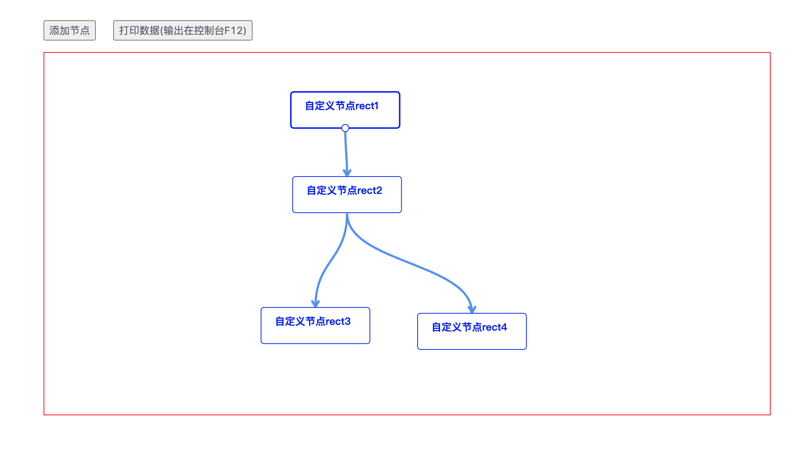

## 介绍
- 基于react和g6的流程图组件
- [在线访问链接](https://kongkong99.github.io/react-g6-flowDiagram/#/list)

## 组件目录
- [流程图组件文件夹](./components/g6Editor)  src/components/g6Editor/
- [使用方式](./views/TestPage/index.js)  src/views/TestPage/index.js

## 效果图
